# AI Assistant with Web Search and Wikipedia Integration

This project implements an intelligent conversational agent that can perform web searches and access Wikipedia information using LangGraph, LangChain, and OpenAI's GPT-4.

## Features

- Natural conversation with GPT-4o
- Web search capabilities using browser automation
- Wikipedia information lookup
- Intelligent routing based on user input

## Prerequisites

- Python 3.8+
- OpenAI API key

## Installation

1. Install required packages:
`pip install langgraph langchain langchain-openai wikipedia-api browser-use python-dotenv playwright`

2. Install Playwright browsers:
`playwright install`

3. Set your OpenAI API key in the `config.py` file.

4. Run the script:
`python agents.py`

This will start the AI assistant, allowing you to engage in natural conversations and perform web searches.

### Commands:
- Ask general questions for conversation
- Start with question words (what, who, where, when, why, how) to search Wikipedia
- Start with "search" to perform web searches
  - Example: "search latest AI developments"
- Type "exit" to end the conversation

## How it Works

The application uses a state machine implemented with LangGraph to route user inputs to appropriate handlers:

1. **Router**: Determines which node should handle the user input
2. **Wikipedia Search**: Handles queries that need Wikipedia information
3. **Browser Search**: Processes web search requests
4. **Conversation**: Manages general chat interactions

## Architecture

The application is built using LangGraph, LangChain, and OpenAI's GPT-4. It leverages LangGraph's state machine capabilities to manage the conversation flow and handle user inputs.

## Flow

The flow now works as follows:
- Every interaction starts at the router
- Router decides between three paths:
  - Direct to conversation (for regular chat)
  - Wiki search → conversation (for questions starting with what, who, where, etc.)
  - Browser search → conversation (for messages starting with "search")
- All paths ultimately end at the conversation node

## Configuration

The system uses several LLM configurations:
- GPT-4 for general conversation
- GPT-4o for web searches (with optimized token usage)

## Error Handling

The system includes robust error handling for:
- API failures
- Search errors
- Invalid user inputs

## Contributing

Feel free to submit issues and pull requests.

## License

MIT

